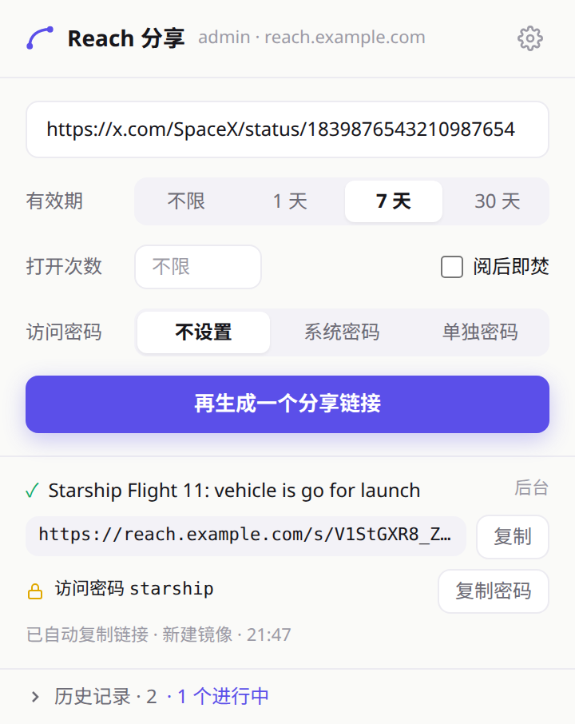
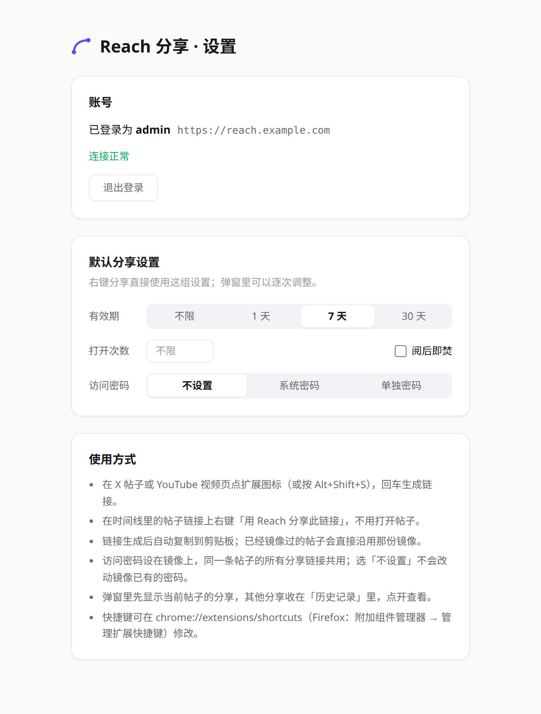

# reach-browser-extension

[简体中文](./README.md) · English

A browser extension (Chrome / Edge / Firefox) for [Reach](https://github.com/fujioky/reach): turn the X post or YouTube video you are looking at into a Reach share link in one step, copied to the clipboard. No more opening the admin, pasting the link, waiting for the fetch and copying the result.

| | |
| --- | --- |
|  |  |
| Popup: the current post, access control and password, this post's share with the rest folded into history | Options: sign in with the admin account, default share settings |

## What it does

- **Three ways in.** On a post, click the toolbar icon or press `Alt+Shift+S` — the popup is already filled in, press Enter. On a timeline, right-click a post link and choose "用 Reach 分享此链接" without opening the post. Or paste any X / YouTube link into the popup.
- **Access control.** Expiry (none / 1 / 7 / 30 days), a view cap, burn after read. The defaults on the options page apply to right-click shares; the popup can change them per link. Finer limits — unique visitors, an exact expiry time — are edited on the link in the Reach admin.
- **Access password.** Choose the site password (the one in Reach's settings) or a password of its own. As in the Reach admin, the password is set on the **mirror**, not on one link: the post's existing share links need it too. "不设置" (none) leaves the mirror's password untouched, and the result says so when a reused mirror is already protected. A password of its own can be copied from the result in one click.
- **No duplicate fetches.** If the post is already mirrored in Reach, the extension adds a new share link to that mirror: it answers instantly and stores no second copy of the images. To update the content, use "重新抓取" on that mirror in the admin.
- **History.** Shares are kept in the extension's local storage, across browser restarts. The popup first shows the latest share of the post in the link box — the current page by default, recognised across x.com / twitter.com and youtu.be / watch forms; every other share sits folded under "历史记录" (history), which can be cleared.
- **Finishes in the background.** Fetching a new post can take tens of seconds. Close the popup whenever you like; the share keeps running in the extension's background with a count on the toolbar icon. When it is done the link is copied, and if no popup is open you get a system notification (clicking it opens the mirror in the admin).

## Requirements

A Reach deployment with the extension API (`/api/extension/*`, see below) and its database migration (the `api_tokens` table).

## Install

The extension is not in the stores; build it yourself. Requires Node.js 22+.

```bash
git clone https://github.com/fujioky/reach-browser-extension.git
cd reach-browser-extension
npm install
npm run build            # Chrome / Edge → .output/chrome-mv3
npm run build:firefox    # Firefox       → .output/firefox-mv3
```

- **Chrome / Edge:** open `chrome://extensions` (`edge://extensions`), turn on Developer mode, choose "Load unpacked" and select `.output/chrome-mv3`.
- **Firefox:** release Firefox only installs signed extensions. Run `npm run zip:firefox` and submit the zip on [addons.mozilla.org](https://addons.mozilla.org/developers/) as "On your own" (unlisted) to have it signed. To just try it, load `.output/firefox-mv3/manifest.json` from `about:debugging` → "This Firefox" → "Load Temporary Add-on"; it is removed when the browser restarts.

## Sign in

Open the extension's options (the gear in the popup) and enter the Reach address with the admin username and password.

The password is used once: Reach checks it and issues a token for this browser, and the extension keeps only the token (in `storage.local`, never synced with the browser account). Reach lists every signed-in extension with its last use under 系统 → 浏览器扩展, where each can be revoked; signing out in the extension revokes its token on the server too. After a revoke, the next share asks you to sign in again.

## How it works

- **The background runs the share; the popup only shows it.** A popup is closed the moment it loses focus, so it cannot hold a request that takes tens of seconds. The popup and the context menu hand the link to the background (Chrome's service worker, Firefox's event page), which writes job state to the share history (`storage.local`); the popup subscribes and renders. A job still marked running when the background starts again was necessarily cut off, and is marked failed with a retry button.
- **The API streams.** `POST /api/extension/share` answers in NDJSON: one line per stage (fetching, copying images, creating the link), then a `done` line. Chrome terminates an extension service worker whose fetch gets no response within 30 seconds, and fetching a new post often takes longer; streaming sends the headers at once. A stream that ends without `done` is a failure — that is what a function timeout looks like.
- **Keep-alive.** While a share runs, the background writes to `storage.session` every 20 seconds: Chrome resets its idle timer on any extension API call, Firefox on an incoming extension event (the `storage.onChanged` that write triggers). Without it, a 70-second share was terminated by Chrome mid-way in testing.
- **Clipboard.** Chrome's service worker has no `navigator.clipboard`, so the text goes to an offscreen document that writes it with `execCommand('copy')` (an offscreen document can never be focused, which rules out the async Clipboard API there too). Firefox's event page has a DOM and writes directly under the `clipboardWrite` permission.
- **Cross-origin.** The extension requests no host permission for the Reach site; the API allows CORS from any origin. That is safe because these endpoints never read cookies: a request carries a token or, when signing in, the password itself.

## Permissions

| Permission | Why |
| --- | --- |
| `activeTab` | Read the current tab's URL when you click the icon or press the shortcut, to prefill the popup |
| `contextMenus` | The right-click entries on post links and post pages |
| `storage` | Sign-in, default settings, share history |
| `clipboardWrite` | Copy the share link automatically |
| `notifications` | Report the result when the popup is closed |
| `offscreen` (Chrome only) | Write to the clipboard outside the service worker |

The extension collects nothing: it sends the links you share (and, at sign-in, the admin credentials) only to the Reach address you entered, and talks to no other service.

## API

These are the only Reach endpoints the extension calls; they live in the Reach repository under `app/api/extension/`.

```
POST   /api/extension/session   { username, password, name }  → { token, username }
GET    /api/extension/session   Authorization: Bearer <token>  → { username }
DELETE /api/extension/session   Authorization: Bearer <token>  → 204 (revokes that token)
POST   /api/extension/share     Authorization: Bearer <token>
       { url, accessControl: { expiresAt, maxViews, burnAfterRead },
         password?: { mode: "inherit" } | { mode: "custom", value } }
       → NDJSON:
         {"type":"stage","phase":"fetching"}
         {"type":"stage","phase":"images","done":0,"total":2}
         {"type":"stage","phase":"saving"}
         {"type":"done","ok":true,"shareUrl":"…","adminUrl":"…","title":"…","reused":false,"fetchedAt":"…","passwordMode":"custom","warnings":[]}
       or {"type":"done","ok":false,"error":"内容不存在或已删除"}
```

`password` is written to the post's mirror (all of its links); leaving it out keeps the mirror's setting. `passwordMode` is the mirror's password state after the share. `inherit` is refused while no site password is set. Every endpoint answers 401 for a revoked token, which signs the extension out.

## Development

Built with [WXT](https://wxt.dev), React and Tailwind CSS 4.

```bash
npm run dev             # Chrome with the extension loaded and hot reload
npm run dev:firefox
npm test                # Vitest (WXT's fake browser)
npm run typecheck
npm run zip             # Chrome zip
npm run zip:firefox     # Firefox zip + sources zip (required for AMO review)
```

```
entrypoints/
  background.ts       share jobs, context menus, notifications, keep-alive
  popup/              the popup
  options/            options page (sign-in, default share settings)
  offscreen/          Chrome only: clipboard writes
utils/
  api.ts              Reach API client (incl. NDJSON reader)
  jobs.ts             share history, post link identity, which pages can be shared
  access.ts           access-control presets and the access password
  settings.ts         sign-in and default settings
  clipboard.ts        background clipboard writes (Chrome / Firefox paths)
components/           shared by the popup and the options page
```
